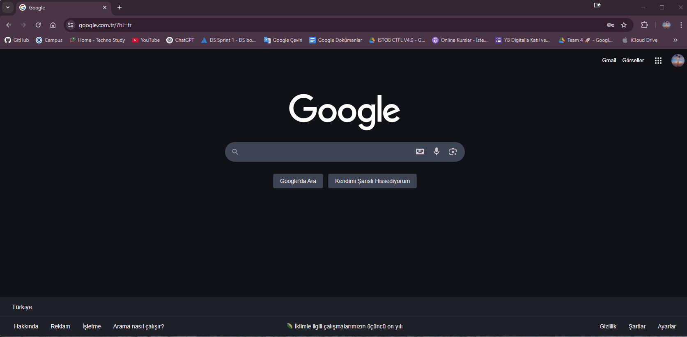
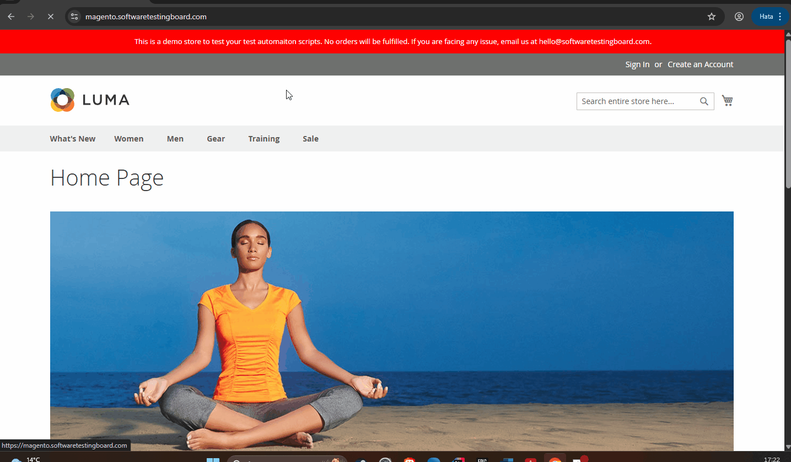

# 🛒 Magento Cucumber Automation Project

## 📌 Table of Contents

* [Project Description](#project-description)
* [Project Structure](#project-structure)
* [Technologies Used and Dependencies](#technologies-used-and-dependencies)
* [Installation](#installation)
* [Usage](#usage)
* [User Stories & Test Scenarios](#user-stories--test-scenarios)
* [Test Coverage Table](#test-coverage-table)
* [Test Reports](#test-reports)
* [Bug Reports](#bug-reports)
* [Project Team](#project-team)
* [GitHub Links](#github-links)
* [License](#license)
* [Contact](#contact)

---

## 📄 Project Description

Magento is one of the world's most popular e-commerce platforms. It offers both free (Magento Open Source) and paid (
Magento Commerce) versions. This project uses the open-source version to automate functional UI tests using **Java**, *
*Selenium WebDriver**, **Cucumber**, **TestNG**, and **Page Object Model (POM)**.

The goal is to test common user actions such as registration, login, address entry, shopping cart operations, and
placing orders on a Magento e-commerce site.

> Test Environment: [https://magento.softwaretestingboard.com](https://magento.softwaretestingboard.com)

---

### 💪 Key Features

* Cucumber with Gherkin syntax for human-readable test cases
* TestNG + XML execution with browser parameterization
* Thread-safe WebDriver management with `ThreadLocal`
* ExtentReports Integration (HTML & PDF)
* Page Object Model (POM) for modular and maintainable code
* Scenario Outline for data-driven testing
* Data Table usage for parameterized inputs

---

## 🏠 Project Structure

```plaintext
MagentoProject_Cucumber/
├── src/
│   └── test/
│       │
│       ├── java/
│       │   ├── featureFiles/                # .feature files written in Gherkin
│       │   ├── hooks/                       # Cucumber Hooks (Before/After)
│       │   ├── pages/                       # Page Object Model classes
│       │   ├── runners/                     # TestNG runner classes
│       │   │   └── XML/                     # TestNG XML configuration files
│       │   ├── stepDefinitions/             # Cucumber step definitions
│       │   └── utilities/                   # Driver, ConfigReader, ExtentReportManager, etc.
│       │
│       └── resources/                       # ExtentReports configuration
│
├── testGifs/                                # GIFs used in reports
├── testReports/                             # Spark & PDF report output (auto-generated)
├── configuration.properties                 # General test configuration
├── pom.xml                                  # Maven build configuration
└── README.md                                # Project README
```

---

## 🧰 Technologies Used and Dependencies


| Tool/Library            | Description                     |
|-------------------------| ------------------------------- |
| Java JDK 21             | Programming Language            |
| Selenium WebDriver 4.32 | Web Automation Tool             |
| Cucumber 7.20           | BDD Testing Framework           |
| TestNG 7.10             | Test Execution Engine           |
| ExtentReports           | Report Generation (HTML & PDF)  |
| Maven                   | Dependency and Build Management |
| Apache POI              | Excel Integration (optional)    |
| Git & GitHub            | Version Control                 |
| SLF4J + Log4j           | Logging Tools                   |

---

## 🚀 Installation

1. Clone the repository:

   ```bash
       git clone https://github.com/Yigit-Cam/MagentoCucumberProject.git
   ```
2. Open the project in IntelliJ IDEA (or any IDE)
3. Run:

   ```bash
       mvn clean install
   ```

---

## 🛠️ Usage

* To run all tests:

  ```bash
    mvn test
  ```
* To run specific browser tests:

  * Use `singleBrowserTesting.xml` or `parallelBrowserTesting.xml`
  * Right-click the XML file and run
  * Or You can run the feature file directly by right-clicking on the feature file in the `featureFiles/` folder.

---

## 🧾 User Stories & Test Scenarios


| User Story | Description            | Status    |
| ---------- | ---------------------- | --------- |
| US_701     | User Registration      | ✅ Passed |
| US_702     | User Login             | ✅ Passed |
| US_703     | Address Transactions   | ✅ Passed |
| US_704     | TAB Menu Check         | ✅ Passed |
| US_705     | Add/Remove from Cart   | ✅ Passed |
| US_706     | Product Order          | ✅ Passed |
| US_707     | Product Search by ID   | ✅ Passed |
| US_708     | Wishlist Functionality | ✅ Passed |

---

## 🛠️ Magento Project - User Stories & Test Scenarios

### **1️⃣ US_701 - User Registration**

📌 The user wants to create a new account by registering on the Magento platform.

✅ **Expected:** After filling in personal and login information, the user should be able to register successfully and receive a confirmation.

✅ **Actual:** The user entered the required details, submitted the form, received a success message, and was redirected accordingly.



---

### **2️⃣ US_702 - User Login**

#### ➕ **Positive Scenario**

📌 The user logs in with valid credentials.

✅ **Expected:** The login must be successful and the user should be redirected to the account page.

✅ **Actual:** Login was successful and the user accessed their account page.


#### ➖ **Negative Scenario**

📌 The user attempts login with invalid or empty credentials.

✅ **Expected:** Login should fail, and an error message should be displayed.

✅ **Actual:** Login attempt failed and appropriate error messages were displayed.



---

### **3️⃣ US_703 - Address Addition**

📌 The user wants to add multiple addresses to their account to manage billing and shipping separately.

✅ **Expected:** Each address should be added successfully and saved separately. The system must allow setting default billing/shipping addresses.

✅ **Actual:** Three addresses were added successfully. Default options were selected, and addresses could be edited or deleted.


---

### **4️⃣ US_704 - TAB Menu Navigation**

📌 The user navigates using the TAB menu to explore categories and subcategories.

✅ **Expected:** TAB menu must list all main categories and show subcategories properly. Links must function.

✅ **Actual:** All main and subcategories displayed correctly. Navigation links directed the user to the expected pages.


---

### **5️⃣ US_705 - Add/Remove Product from Cart**

📌 The user manages their shopping cart by adding, editing quantity, or removing items.

✅ **Expected:** User must be able to add products to the cart, update quantities, and remove items.

✅ **Actual:** Products were successfully added to the cart, quantities were updated, and items were removed as expected.


---

### **6️⃣ US_706 - Product Ordering**

📌 The user completes the shopping process by entering address and payment details and placing an order.

✅ **Expected:** After adding products to the cart, the user should complete checkout, confirm shipping and billing details, and see an order confirmation.

✅ **Actual:** The user successfully placed the order, selected shipping method, confirmed address, and received an order confirmation with a number.


---

### **7️⃣ US_707 - Search Functionality**
#### ➕➖ **Positive and Negative Scenario**

📌 The user searches for a product using a SKU number.

✅ **Expected:** The system should return results for valid SKUs and show "no results" for invalid ones. SKU should appear on the product page.

✅ **Actual:** The valid SKU returned the correct product, and invalid SKUs displayed the correct warning message.


---

### **8️⃣ US_708 - Wish List Feature**

📌 The user wants to manage a list of favorite products for easier access later.

✅ **Expected:** Products should be added and removed from the wish list, with proper confirmation and list updates.

✅ **Actual:** Products were successfully added and removed from the wish list. Visual confirmations were shown, and the list updated accordingly.


---

## 📊 Test Coverage Table


| Scenario               | Priority |
| ---------------------- | -------- |
| User Registration      | High     |
| User Login             | High     |
| Address Entry          | High     |
| TAB Menu Check         | Medium   |
| Cart Operations        | Medium   |
| Product Order          | High     |
| Product Search         | Low      |
| Wishlist Functionality | Low      |

---

## 📈 Test Reports


| Report Type  | Description                         |
| ------------ | ----------------------------------- |
| Spark Report | Rich HTML report with screenshots   |
| PDF Report   | Printable report with scenario logs |

Find reports under:

```bash
    /testReports/SparkReport/
    /testReports/PDFReport/
```

---

## 🐞 Bug Reports

Bug tracking is handled in the GitHub Issues tab.

- Not found any bugs.


---

## 👥 Project Team


| Name          | Role                       | User Stories   |
| ------------- | -------------------------- | -------------- |
| Yigit Cam     | Project Lead & QA Engineer | US_705, US_706 |
| Zafer Ataklı | QA Engineer                | US_703         |
| Nuri Öztürk | QA Engineer                | US_707         |
| Rıfat Batır | QA Engineer                | US_704         |
| Tugba Kilic   | QA Engineer                | US_701, US_702 |
| Azim Korkmaz  | QA Engineer                | US_708         |

---

## 🔗 GitHub Links

* 📁 [Main Repository](https://github.com/Yigit-Cam/MagentoCucumberProject)

**Contributors:**

* [Zafer Ataklı](https://github.com/zaferatakli)
* [Rıfat Batır](https://github.com/rftbtr)
* [Tugba Kilic](https://github.com/TugbaKilic33)
* [Nuri Öztürk](https://github.com/NuriOzturk)
* [Azim Korkmaz](https://github.com/AzimKorkmaz)
* [Yigit Cam](https://github.com/Yigit-Cam)

---

## 📜 License

This project is licensed under the [MIT License](https://opensource.org/licenses/MIT).

---

## 📧 Contact

For questions or suggestions, please reach out via GitHub issues or directly to project contributors.

---
